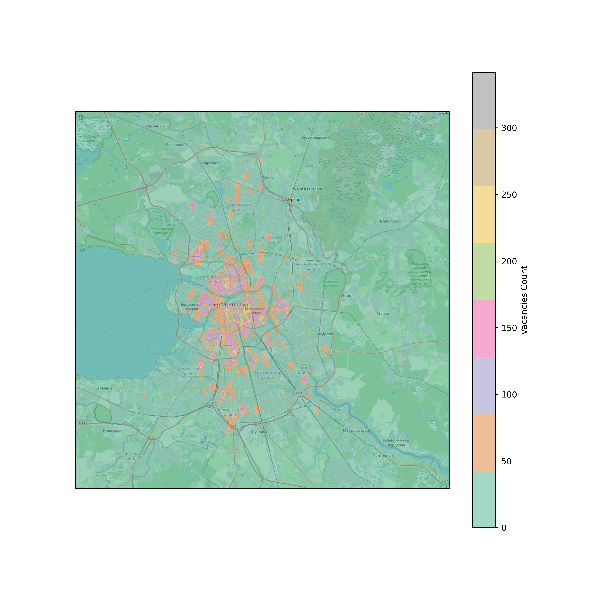
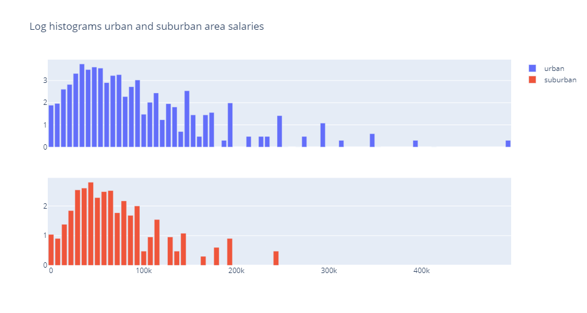
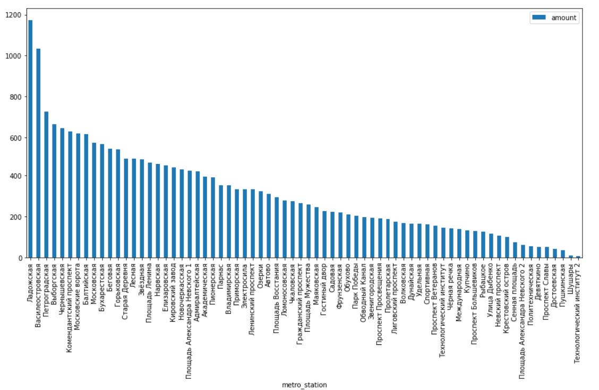

# Report on Big Data Infrastructure project

2022/06/26

Team DataStorm:

> Vladimir Barkovskii - J41332c\
Ilia Moiseev - J41325c\
Artemii Glaznev - J41325c
> 

[Project presentation](https://docs.google.com/presentation/d/13wd82lnpOcz9Jy1xW8mlBk_9by2wd-Rz/edit?usp=sharing&ouid=102358248161692181834&rtpof=true&sd=true)

---

# Introduction

The task of the course project was to implement automatic data collection system, process and analyze gathered data.

The topic chosen was job market in Saint-Petersburg. The data source - headhunter API.

The goal was to collect and analyze vacancies with all their properties and describe the demand for labor in Saint-Petersburg.

# Data collection

## Frameworks

The collection of data started from studying documentation on **hh API**. It was feasible and easy enough to use to not to consider the option of scraping, so no framework was needed.

For storage of data we chose **Clickhouse**. It is **column-oriented database management system that allows analysis of data that is updated in real time. Clickhouse is fast, built for efficient queries and has good compression rate. We chose it, because we intended to build aggregating queries and not for row updating or row selects.

For data processing we chose **Spark** for efficient processing of batches of data. At the beginning we considered Storm, but then discarded this idea since we didn’t want streaming processing and live updates.

*(All decisions about frameworks were made before the announcement of any labs, any similarities are coincidental, see commit history)*

## Data collection system

Headhunter API works just like regular search - you enter the keywords, specify filters and then you get the pages with search results.

We chose to implement independent entities to encapsulate calls to the API, parsing responses and the work with database.

.png)

**APICaller** manages hh API specifics including pagination, parameters and limits. Basically it implements Iterator that given search parameters returns batches of objects on `__next__`

**APIResponseParser** prepares batches before passing them to the DB manager. Vacancies come in the format of nested JSON objects. To save them in the table we need to flatten their structure. This entity helps with this - to not include this specificity in the DB manager.

Additionally this layer implements data validation in form of schema check. It checks that all columns have correct types.

**DBSaver** manages calls to the database. It receives row response batches from remote API and deals with it in case of data cleaning and data assertion before inserting in data base system.

### **The usage and first issues**

```python
	caller_params = {
        'per_page': args.per_page,
        'area': args.area
    }

    caller = APICaller(args.mask, **caller_params)
    saver = DBSaver() # ResponseParser call inside

    logger.info('Downloader started')

    while True:
        vacancies = caller.get_batch()
        saver.save_batch(vacancies)

		time.sleep(args.period)
```

There were no problems when we tried to use this pipeline for the first time.

Until we crushed in the 2000 limit.

hh API has the limit for any single query to have no more than 2000 results. Considering that we could run our pipeline over and over with default parameters and get only new ones appearing every day. 

The developers of API itself do not consider big data analysis as the application for it, so they do not give ways to increase this value somehow.

This speed of collection was not enough, so we chose the easiest way to increase the number of different vacancies - *specify different parameters*. Since the API restricts by 2000 only *single query* we could do the number of different ones to collect more.

We used the list of 1400 different professions to build specific queries. And then Iterator interface that simplified the usage of API Caller was also implemented.

```python
while True:
    with open(PROFESSIONS_PATH, encoding='utf-8') as professions:
        for profession in professions:
            caller_params = {'text': str(profession), 
								'per_page': args.per_page, 
								'area': args.area}
            caller = APICaller(args.mask, **caller_params)
            
            for batch in caller:
                if len(batch) == 0:
                    break

                saver.save_batch(batch)

                if args.period != 0:
                    time.sleep(args.period)
```

With relatively easy solution like this we managed to solve the problem of strict hh API limits on queries.

# Data processing

## Dataset description

While parsing open **hh API** we collected *1.432.515* vacancies. Some table description represented below:

| Number of rows | 1.432.515 rows |
| --- | --- |
| Number of columns | 66 columns |
| Table size | 563.410.072 bytes ~0.55 GiB  |

What about concrete fields that **hh API** responses? It returns a number of interesting fields such as id, name, city, salary, address and coordinates, closest metro station, date of publishing, employer name, schedule rule and mush other. Let’s consider a brief description of represented fields:

| Field name Description field | None values percentage | Most frequently value, percentage (quantile for numeric) | Data type | Count of unique values |
| --- | --- | --- | --- | --- |
| name | 0, 0% | Менеджер по продажам, 1.4% | String | 137882 |
| city | 0, 0% | Москва, 57% | String | 4 |
| salary | 346.787, 33% | (31800.0, 40000.0], 15% | Float32 | 2471 |
| address | 478.651, 39% | Санкт-Петербург, Московский проспект, 1.1% | String | 34092 |
| coordinates | 979.058, 34% | (55.635, 55.708], (37.597, 37.635], 10%, 10% | Float32 | 47527 |
| metro station | 587.331, 41% | Ладожская, 1.6% | String | 379 |
| date of publishing | 0, 0% | 2022-01-30, 7.8% | Date | 129 |
| employer name | 0, 0% | Пятёрочка, 0.57% | String | 55545 |
| schedule rule | 0, 0% | Полный день, 95.2% | String | 5 |
| id | 0, 0% | — | UInt32 | 1.432.515  |

### DB Connection

The first problem was to efficiently connect Spark with Clickhouse.

For this problem we used native JDBC from this repo

[https://github.com/housepower/ClickHouse-Native-JDBC](https://github.com/housepower/ClickHouse-Native-JDBC)

## Pipelines description

### Heatmap of salaries and vacancies

This pipeline helps us to visualize the distribution of mean salaries and count vacancies across Saint-Petersburg.

```python
# ...
# Getting vacancies across Saint-Petersburg into defined square
vacancies_df = vacancies_df.select([
        'id', 'salary_from', 'salary_to', 'address_lat', 'address_lng']) \
        .where(vacancies_df['address_lng'] > min_lng) \
        .where(vacancies_df['address_lat'] > min_lat) \
        .where(vacancies_df['address_lng'] < max_lng) \
        .where(vacancies_df['address_lat'] < max_lat) \
        .toPandas()

# Getting values of grid through Ox and Oy 
grid_ox = np.linspace(min_lat, max_lat, step_ox)
grid_oy = np.linspace(min_lng, max_lng, step_oy)

# Calculate an indexes acrross ttwo dimensions
vacancies_df['ind_ox'] = (vacancies_df['address_lat'].values[:, None] >= grid_ox).sum(axis=1) - 1
vacancies_df['ind_oy'] = (vacancies_df['address_lng'].values[:, None] >= grid_oy).sum(axis=1) - 1

# 2D grid
mean_salary = vacancies_df.pivot_table(
    index=['ind_oy', 'ind_ox'],
    values='salary_from',
    aggfunc='mean',
)
count_vacancies = vacancies_df.pivot_table(
    index=['ind_oy', 'ind_ox'],
    values='id',
    aggfunc='count',
)

# Calculate grid to plot
mean_density = np.zeros(np.broadcast(grid_ox, grid_oy[:, None]).shape, dtype=np.float32)
count_density = np.zeros(np.broadcast(grid_ox, grid_oy[:, None]).shape, dtype=np.float32)

for ind, item in mean_salary.iterrows():
    mean_density[ind] = item

for ind, item in count_vacancies.iterrows():
    count_density[ind] = item

# ...
```

### Work schedule dynamic

This sector of code calculates and preprocess necessary data to visualize how the ratio of work schedule changes through months. The code of calculations represented below:

```python
# ...
# Receiving data from DataBase and grouping by
df = df.groupby(['published_at', 'schedule_name']) \
    .count() \
    .orderBy('published_at') \
    .toPandas() \
    .pivot('published_at', 'schedule_name') \
    .fillna(0)

# Finding the percentage ratio among day
df = df.div(df.sum(axis=1), axis=0)

# And renaming
df.rename(columns = {
    'Вахтовый метод': 'Fly-in fly-out',
    'Гибкий график': 'Flexible schedule',
    'Полный день': 'Full day',
    'Сменный график': 'Shift schedule',
    'Удаленная работа': 'Remote work',
}, inplace = True)

# ...
```

### Urban-suburban salaries comparison

Histograms of salaries for urban and suburban areas were made as following:

```python
# ...
# city df was made using select constraining by coordinates

city_hist = city.select('salary_from').rdd.flatMap(lambda x: x).histogram(75)
city_hist = pd.DataFrame(
        list(zip(*city_hist)), 
        columns=['bin', 'freq']
    ).set_index('bin')
city_hist['freq'] = city_hist['freq'].apply(np.log10)

# ...
```

### Visualization of vacancies by metro stations

Barplot of the number of vacancies near each metro station was made as following:

```python
# ...

saintpi = data.loc[data['address_city'] == 'Санкт-Петербург']
bar_plot = saintpi.address_metro_station_name.value_counts().rename_axis('metro_station')
fig = sain[:70].plot.bar('metro_station', 'amount')

# ...
```

# Analysis

## Heatmap of salaries


Heatmap of mean salaries distribution above Saint-Petersburg



Heatmap of vacancy count distribution above Saint-Petersburg

## Work schedule dynamic


Dynamic of vacancies work schedules

## Salaries in urban and suburban areas



## Visualization of vacancies by metro stations



Barplot with the number of vacancies at each metro station

# Conclusion

As a result of this project, we implemented the collection of data through the API, the storage of the collected data in a database, and analysis of this data using Spark.
